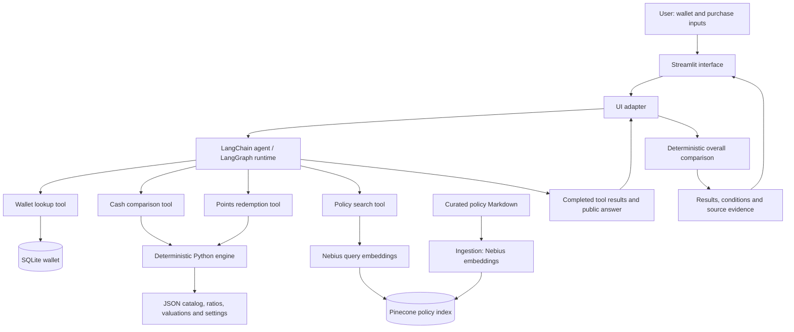

# RewardPilot

**Your cards. Your points. A smarter way to pay.**

RewardPilot is an agentic credit-card and rewards optimizer that helps you choose which card to use and whether a quoted travel booking offers better value with cash or points. It combines a personal rewards wallet, deterministic Python calculations, and retrieval-augmented generation (RAG) to explain the numbers alongside the policy conditions that matter.

Built with **Python · Streamlit · LangChain / LangGraph · Nebius · Pinecone · SQLite**.

> **Screenshot placeholder:** Add a screenshot of the wallet, purchase form, and recommendation here.
<!-- Replace the placeholder above after adding the file:

-->

[Quick start](#quick-start) · [Architecture](#architecture) · [Supported scenarios](#supported-scenarios) · [Evaluation](#evaluation-and-testing) · [Roadmap](#roadmap)

## Overview

A higher rewards multiplier does not always mean a better deal. Different reward currencies have different estimated values; booking channels affect earning; and an attractive award quote may require a transfer with additional restrictions or fees.

RewardPilot brings these decisions into one interface. Add your cards and program balances, enter a purchase, and select **Find My Best Option** to see ranked cash-payment options, an optional points comparison, and relevant policy evidence.

### The problem

Rewards decisions typically require checking several sources at once:

- Which cards in my wallet earn the most for this purchase and booking channel?
- Is the quoted points price worthwhile after taxes and the value of points consumed?
- Do I have enough points, or is there a feasible transfer path?
- Which eligibility rules or exclusions could change the recommendation?

RewardPilot combines those checks into an explainable decision while keeping calculations in code and policy evidence traceable to its source.

## Key features

- **Personal rewards wallet:** Manage supported cards and program balances with local SQLite storage. Cards in the same program share one balance.
- **Wallet-aware recommendations:** Compare active, owned cards rather than recommending cards the user does not have.
- **Category and channel matching:** Account for purchase type, merchant, booking channel, and explicitly supplied eligibility details.
- **Cash-card ranking:** Compare estimated dollar reward value across points, miles, and cash back.
- **Quoted award evaluation:** Calculate redemption value, points shortfall, and configured transfer options using the price the user provides.
- **Overall comparison:** Show a clear winner, conditional advantage, close call, or insufficient-data result using a deterministic effective-cost calculation.
- **Policy-aware explanations:** Retrieve relevant policy excerpts with source metadata and flag missing evidence.
- **Visible completed activity:** Show which rewards checks finished, alongside structured results and the public explanation.

## Supported scenarios

The current Streamlit interface offers five purchase categories:

| Category | Inputs and comparisons |
| --- | --- |
| **Flight** | Airline, cash price, and booking channel; optional Delta SkyMiles quote with taxes and fees. |
| **Hotel** | Hotel or merchant and booking channel; prepaid eligibility where applicable; optional Marriott Bonvoy or Hilton Honors quote. |
| **Groceries** | Merchant, in-store or online purchase, U.S. supermarket eligibility, online-grocery eligibility, and Prime membership. |
| **Restaurant** | Merchant and purchase amount, mapped to supported dining categories. |
| **Amazon** | Purchase amount and Prime membership eligibility. |

Travel channels include direct booking, Amex Travel, Chase Travel, and **Other / Not sure**. Unknown details remain explicit rather than silently qualifying a purchase for a bonus.

The card catalog contains Chase Sapphire Preferred, Chase Sapphire Reserve, Prime Visa, Amex Gold, Amex Platinum, Delta SkyMiles Gold / Platinum / Reserve Amex, and Marriott Bonvoy Boundless. **Catalog inclusion does not imply complete category coverage.** Flight-specific mapping currently handles Delta Platinum Amex, Amex Gold, and Chase Sapphire Preferred; other cards can fall back to their base earning category.

Grocery and restaurant calculations assume applicable spending caps have not been reached. Additional transfer programs exist in the backend configuration, but the UI's award choices are limited to the programs listed above.

### A short demo walkthrough

1. Open **My Rewards Wallet** and review the cards and balances.
2. Select **Try an example** to load a $1,500 Delta flight with a quoted 90,000-mile award and $33.60 in taxes and fees.
3. Select **Find My Best Option**.
4. Compare the cash-card ranking, points feasibility, effective-cost result, and policy checks.
5. Switch to groceries, a restaurant, or Amazon to demonstrate everyday card selection.

The example is an illustrative input, not a live fare or award offer. Results depend on the current wallet and configured valuations.

## Architecture



> **Architecture image placeholder:** For a slide-ready export, add `assets/screenshots/rewardpilot-architecture.png`. The Mermaid diagram above renders directly on GitHub.

The UI adapter validates completed tool outputs against the submitted purchase and attaches the engine's overall comparison. The agent explains cash and award findings; the structured overall winner is calculated by Python after the tool results are collected.

## Why it is agentic

RewardPilot uses an LLM to choose and sequence tools based on the purchase and the available information. An everyday purchase needs a different set of checks from a travel award with a points shortfall and transfer-policy questions.

| Agent tool | Responsibility |
| --- | --- |
| `get_rewards_wallet` | Retrieve owned cards and reward balances. |
| `compare_cash_payment` | Calculate and rank rewards for the purchase. |
| `evaluate_points_redemption` | Evaluate the quoted award, shortfall, and transfer feasibility. |
| `search_rewards_policy` | Retrieve eligibility rules, exclusions, and transfer restrictions. |

The autonomy is bounded: the model orchestrates tools and explains their results; Python performs reward calculations. The user starts each analysis. No tool books travel, charges a card, or transfers points.

## RAG and the deterministic decision engine

### RAG answers policy questions

The `rag_docs/` corpus contains curated policy summaries covering subjects such as Amex travel earning, Chase transfer mechanics and Points Boost, Delta award discounts and baggage benefits, and Marriott award and certificate conditions.

Each policy carries metadata including an official source URL, program, policy type, and last-verified date. The current ingestion script embeds **each complete policy document** with Nebius and stores it in Pinecone. Retrieval uses semantic similarity, optional program and policy-type filters, a score threshold, and source deduplication.

Retrieved text supports explanations of conditions and exceptions. It does not supply live award inventory, replace structured reward rules, or establish whether a particular booking qualifies. Missing evidence is reported as a gap.

### Python owns the numbers

Structured JSON supplies earning rules, transfer ratios, redemption rules, point valuations, and comparison settings. SQLite supplies the user's wallet. The engine uses these inputs to calculate rewards, shortfalls, transfer requirements, and estimated effective costs.

Conceptually:

```text
Cash effective cost = quoted cash price − estimated value of earned rewards

Points effective cost = award taxes and fees
                      + estimated value of the reward currencies consumed
                      + quantified transfer fees
```

For a transfer-funded award, the calculation values the source currency consumed as well as existing destination points used. Unconfirmed transfer fees remain an explicit limitation. Missing valuations or unresolved transfer paths can prevent a definitive comparison.

The configured close-call threshold is 5%. Point valuations are editable estimates, not guaranteed cash values. Award quotes remain unchanged: RewardPilot does not automatically apply TakeOff 15 or other discounts to the user's entered price.

## Tech stack

| Layer | Current implementation |
| --- | --- |
| Application | Python 3.12+, Streamlit 1.57+ |
| Presentation | Streamlit, pandas, Altair, custom CSS |
| Agent orchestration | LangChain `create_agent`, LangGraph runtime, `langchain-openai` |
| Language model | Nebius-hosted `Qwen/Qwen3-30B-A3B-Instruct-2507` |
| Embeddings | Nebius `Qwen/Qwen3-Embedding-8B`, 4,096 dimensions |
| Retrieval | Pinecone, cosine similarity, `rewardpilot-policies` namespace |
| Storage | SQLite wallet; JSON reward rules and valuations; Markdown policies |
| Configuration and dependencies | `python-dotenv`, Streamlit Secrets, `pyproject.toml`, `uv.lock` |
| Validation | Unit tests, golden tool evaluation, opt-in live integration checks |

## Quick start

### 1. Install dependencies

Prerequisites: Git, Python 3.12 or newer, `uv`, a Nebius API key with access to the configured models, and a Pinecone API key with index access.

```bash
git clone https://github.com/divyasahni87-pixel/RewardPilot.git
cd RewardPilot
uv sync --locked
```

Run the commands below from the repository root; some data paths are relative to that directory.

### 2. Configure credentials

For local development, create a `.env` file in the repository root:

```dotenv
NEBIUS_API_KEY=your-nebius-api-key
PINECONE_API_KEY=your-pinecone-api-key
PINECONE_INDEX=rewardpilot-rag-nebius
```

| Variable | Required | Purpose |
| --- | --- | --- |
| `NEBIUS_API_KEY` | Yes for analysis and ingestion | Model and embedding requests. |
| `PINECONE_API_KEY` | Yes for the current analysis configuration and ingestion | Policy index access. |
| `PINECONE_INDEX` | Optional | Defaults to `rewardpilot-rag-nebius`. |

The backend reads environment variables with `os.getenv()` and loads `.env` through `python-dotenv`. Exported environment variables also work.

**Streamlit Secrets alternative:** Create `.streamlit/secrets.toml` with these root-level values:

```toml
NEBIUS_API_KEY = "your-nebius-api-key"
PINECONE_API_KEY = "your-pinecone-api-key"
PINECONE_INDEX = "rewardpilot-rag-nebius"
```

Streamlit makes root-level secrets available as environment variables during app startup, so the existing backend can read them. Restart the app after adding or changing secrets. See [Streamlit secrets management](https://docs.streamlit.io/develop/concepts/connections/secrets-management).

Standalone scripts such as policy ingestion do not launch Streamlit: provide `.env` or exported environment variables for those commands even if the UI uses Streamlit Secrets. Avoid conflicting values across configuration sources.

Keep `.env`, `.streamlit/secrets.toml`, the local wallet database, and live-test traces out of Git. The repository's `.gitignore` includes these private files.

### 3. Initialize a sample wallet

For a fresh local database:

```bash
uv run python seed_demo_wallet.py
```

This creates a sample user with Delta Platinum Amex, Amex Gold, and Chase Sapphire Preferred, plus sample program balances. The current UI uses user ID `1`, which the sample user receives in a fresh database.

Use **Manage Wallet** to edit the wallet afterward. Re-running the seed script restores its configured balances and adds its sample cards if missing; it is not a read-only operation.

### 4. Populate the policy index

With `.env` or exported credentials configured:

```bash
uv run python ingest_pinecone.py
```

The script creates the configured index if needed, using 4,096 dimensions, cosine similarity, and AWS `us-east-1`. An existing index must match the embedding configuration.

**Ingestion replaces the contents of the `rewardpilot-policies` namespace.** Use a dedicated project index. The script prepares document embeddings before clearing old vectors, then uploads and verifies the replacement corpus. This step calls external services and may incur usage charges.

### 5. Run locally

```bash
uv run streamlit run app.py
```

Open [RewardPilot locally](http://localhost:8501). Review the wallet, enter a purchase or select **Try an example**, then select **Find My Best Option**.

### Streamlit Community Cloud

Select this repository and `app.py` as the entry point, use a compatible Python version, and add the same TOML credentials through the app's Secrets settings. Populate Pinecone separately with the ingestion command before using policy retrieval. See [Community Cloud secrets setup](https://docs.streamlit.io/deploy/streamlit-community-cloud/deploy-your-app/secrets-management).

The current wallet is local SQLite with a fixed UI user ID. A hosted version needs persistent storage and authentication before it can serve independent private user wallets.

## Evaluation and testing

The repository separates deterministic checks from live model and retrieval checks:

| Area | Coverage |
| --- | --- |
| Decision engine | Reward calculations, cash-back units, valuations, cash-versus-points comparison, and transfer feasibility. |
| Purchase mapping | Category and channel selection, eligibility inputs, and fallback behavior. |
| Wallet | Database operations, wallet management, and owned-card constraints. |
| RAG | Policy documents and metadata, ingestion, filters, evidence content, and empty-evidence handling. |
| UI integration | Structured tool results, comparison finalization, and recommendation rendering. |
| Golden scenarios | Expected tool outputs and structured claims against defined cases in `data/eval_cases.json`. |

Start with the documented offline checks:

```bash
uv run python -m unittest test_app test_agent_components test_ingest_pinecone test_wallet_db
uv run python test_decision_engine.py
uv run python test_rewardpilot_eval.py
```

These commands are a starting subset; additional test modules cover the areas above. The golden evaluator reports failed cases and known coverage gaps. It invokes tools directly, so it **does not measure agent tool-selection accuracy or generated-response hallucination rate**. Live retrieval is also not measured in its default offline mode.

Opt-in live checks:

```bash
uv run python test_rewardpilot_eval.py --live-policy
uv run python test_ui_agent_live.py
```

The first command exercises embeddings and Pinecone retrieval without the chat agent. The second exercises the live agent/UI workflow and writes a gitignored `ui_live_results.json`. Live checks send scenario data—and, for the agent workflow, wallet data—to configured services and may incur usage charges.

No blanket pass rate or hallucination score is claimed here; use the current test output when reporting demo results.

## Repository structure

```text
RewardPilot/
├── app.py                      # Streamlit entry point
├── ui_agent.py                 # Agent adapter and comparison finalization
├── rewardpilot_agent.py        # Model configuration and agent instructions
├── agent_tools.py              # Wallet, cash, award, and policy tools
├── decision_engine.py          # Deterministic reward and comparison logic
├── purchase_mapper.py          # Purchase-to-card earning categories
├── recommendation_view.py      # Recommendation presentation helpers
├── wallet_db.py                # SQLite wallet operations
├── wallet_ui.py                # Wallet management interface
├── seed_demo_wallet.py         # Sample wallet initialization
├── rag_retriever.py            # Filtered policy retrieval
├── rag_answer.py               # Policy-answer helper
├── ingest_pinecone.py          # Policy embedding and index ingestion
├── data/
│   ├── card_catalog.json
│   ├── comparison_settings.json
│   ├── reward_valuations.json
│   ├── redemption_rules.json
│   ├── transfer_rules.json
│   ├── demo_scenarios.json
│   ├── eval_cases.json
│   └── README.md
├── rag_docs/                   # Curated policies, manifest, and corpus notes
├── assets/rewardpilot.css      # Application styling
├── .streamlit/config.toml      # Streamlit configuration
├── src/rewardpilot/            # Package entry point
├── test_*.py                   # Unit, scenario, and integration checks
├── RUNNING_REWARDPILOT.md       # Additional run and validation notes
├── pyproject.toml
├── uv.lock
└── README.md
```

Local-only files include `.env`, `.streamlit/secrets.toml`, and `data/rewardpilot.db`.

## Screenshots

| Planned image | What to show |
| --- | --- |
| `assets/screenshots/rewardpilot-overview.png` | Wallet and purchase planning interface. |
| `assets/screenshots/cash-vs-points.png` | Ranked cards, quoted award, and overall comparison. |
| `assets/screenshots/policy-evidence.png` | Policy excerpts, source details, and conditions. |
| `assets/screenshots/wallet-management.png` | Card selection and editable program balances. |

These are placeholders for project screenshots; the files are not included yet.

## Roadmap

- Broaden card-specific earning coverage, especially flight mappings, and track spending caps.
- Expand golden cases and measure live agent tool selection, citation quality, and unsupported prose claims.
- Add live cash-fare and award-availability integrations.
- Connect reward accounts for balance synchronization with user consent.
- Model account-specific eligibility, transfer increments, promotions, and more complete transfer fees.
- Improve multi-path transfer comparisons and user-adjustable point valuations.
- Add authenticated wallets backed by persistent hosted storage.
- Explore proactive alerts and longer-term card and rewards portfolio optimization.

## Disclaimer

RewardPilot is an educational portfolio project, not financial advice. Rewards values are estimates, and program terms can change. Verify prices, availability, eligibility, and transfer conditions with the provider before acting. RewardPilot does not execute purchases, bookings, or points transfers and is not affiliated with the featured issuers or rewards programs.
